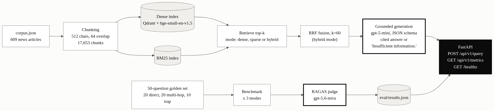
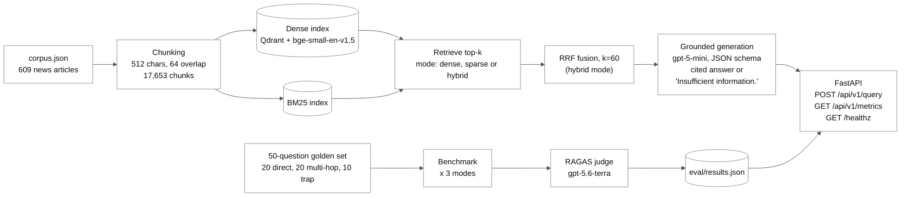
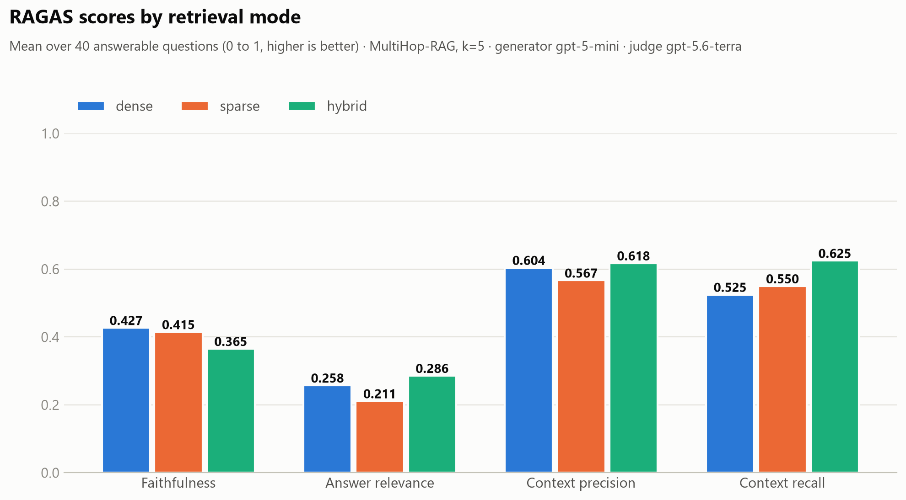
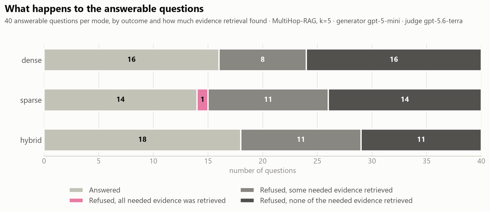

# eval-hybrid-rag

**An evaluation-driven comparison of dense, sparse and hybrid retrieval for RAG on multi-hop news questions.**

> **Technical report:** [*Is Hybrid Retrieval Worth It? An Evaluation-Driven Comparison of Dense, Sparse and Hybrid RAG on Multi-Hop News Questions*](paper/experiment_report.pdf)
> Ahmad Tawil, September 2026 · [PDF](paper/experiment_report.pdf) · [LaTeX source](paper/experiment_report.tex)
>
> **Headline result:** hybrid search found the most of the needed evidence (context recall 0.625 vs 0.525 for dense), but with 40 scored questions the gain is suggestive, not conclusive. The larger finding is that retrieval, not the language model, is the bottleneck: the top 5 results held only 17 to 26% of the evidence a question needs.

[Architecture](#architecture) · [Results](#results) · [Quickstart](#quickstart) · [API examples](#api-examples) · [Design decisions](#design-decisions) · [Limitations](#limitations-and-next-steps)

A retrieval-augmented generation (RAG) pipeline over 609 news articles that is judged by measurements, not by how good one answer looks. It compares three retrieval strategies on the same 50-question benchmark: **dense** (embeddings in Qdrant), **sparse** (BM25) and **hybrid** (both, fused with Reciprocal Rank Fusion). Answers are generated from the retrieved text only, with citations, and the model must say "Insufficient information." when the evidence is not there. Quality is scored with RAGAS (faithfulness, answer relevance, context precision, context recall) plus latency and a refusal check on questions that cannot be answered. Everything is served by a FastAPI app you can start with one command.

## Architecture



Thick borders are LLM steps. The evaluation flow (bottom row) runs offline and writes `eval/results.json`, which the API serves at `/api/v1/metrics`.

<details>
<summary>Mermaid source</summary>



</details>

## Results

50 questions sampled from MultiHop-RAG (20 direct, 20 multi-hop, 10 trap), `k=5`, generator `gpt-5-mini`, RAGAS judge `gpt-5.6-terra`. RAGAS scores are averaged over the 40 answerable questions; the 10 trap questions are scored separately by whether the model correctly refuses. Full numbers: [`eval/results.json`](eval/results.json).

| Mode | Faithfulness | Answer relevance | Context precision | Context recall | Trap refusal | Latency mean / p95 |
|---|---|---|---|---|---|---|
| dense | **0.427** | 0.258 | 0.604 | 0.525 | 8/10 | 10.8 s / 21.1 s |
| sparse | 0.415 | 0.211 | 0.567 | 0.550 | **9/10** | **10.0 s / 17.0 s** |
| hybrid | 0.365 | **0.286** | **0.618** | **0.625** | **9/10** | 12.1 s / 21.2 s |

Bold = best in column.





More charts are in [`eval/charts/`](eval/charts/): refusal behaviour, latency, and how much of the needed evidence retrieval finds.

### Key finding

Hybrid retrieval had the best context recall (0.625 against 0.525 for dense), but the bigger result is that **retrieval recall, not the generator, is the bottleneck**. With `k=5`, only 17% (dense), 21% (sparse) and 26% (hybrid) of the evidence a question needs was retrieved on average, so the model, following its "answer only from the context" rule, refused 22 to 26 of the 40 answerable questions. Details and caveats are in [Limitations and next steps](#limitations-and-next-steps).

### Where the time goes

Latency is almost all the LLM call. Measured without the LLM, the whole endpoint (retrieval, RRF and building the response) took 38 ms (dense), 50 ms (sparse) and 83 ms (hybrid). The 10 to 12 s averages come from `gpt-5-mini`, a reasoning model. A faster or lower-reasoning model would cut that a lot; this is listed under next steps.

## Quickstart

```bash
docker compose up --build
```

Then open <http://localhost:8000/docs>.

- The first start downloads the dataset and builds both indexes, then the API starts. On a fresh machine with an empty Qdrant this took about 20 minutes in total (measured on an 8-core CPU, no GPU needed), most of it embedding the 17,653 chunks; later starts skip that and take under a minute.
- `/healthz` and `/api/v1/metrics` work immediately. **`/api/v1/query` calls the OpenAI API**, so copy `.env.example` to `.env` and set `OPENAI_API_KEY` first. Each answer costs a fraction of a cent with the default model. The key is read from `.env` at runtime and is never copied into the image.
- Stop with `docker compose down` (your indexes are kept in Docker volumes; add `-v` to delete them).

Production-style run (restart policy, Qdrant not published to the host):

```bash
docker compose -f docker-compose.yml -f docker-compose.prod.yml up -d --build
```

### Without Docker

```bash
uv sync
docker compose up -d qdrant          # Qdrant only
uv run python scripts/download_data.py
uv run python -m app.ingest
uv run uvicorn app.main:app --reload
```

## API examples

```bash
# Ask a question. mode is dense, sparse or hybrid (default hybrid).
curl -X POST localhost:8000/api/v1/query \
  -H "Content-Type: application/json" \
  -d '{"query": "Who founded the studio behind the game Cocoon?", "mode": "hybrid"}'

# The benchmark results (read from eval/results.json, not recomputed)
curl localhost:8000/api/v1/metrics

# Health: 200 only if Qdrant is reachable AND the embedding model works, otherwise 503
curl localhost:8000/healthz
```

Example `/api/v1/query` response (shape, from a real run in sparse mode):

```json
{
  "answer": "The studio behind Cocoon was founded by Jeppe Carlsen [2189b4a1fb241f18].",
  "latency_ms": 5136.0,
  "citations": [
    {
      "chunk_id": "2189b4a1fb241f18",
      "source_file": "Save on the winners from the 2023 Game Awards this weekend",
      "section_header": "Save on the winners from the 2023 Game Awards this weekend — Polygon"
    }
  ]
}
```

Invalid input (an unknown `mode`, an empty `query`) returns 422.

## Design decisions

- **Chunking:** 512 characters with 64 overlap, so a fact split across a boundary still appears whole in one chunk. Chunk ids are a hash of URL, position and text, so they are stable across re-ingestion.
- **Two indexes, one id space:** the BM25 index and Qdrant are built from the same chunks, and ingest fails loudly if their id sets differ.
- **RRF with `k=60`, untuned:** hybrid fuses the top 50 from each list. Tuning was left for later on purpose.
- **Grounded generation as a hard constraint:** the system prompt allows only the provided context and requires an exact "Insufficient information." otherwise. The output is validated against a JSON schema, malformed output raises instead of shipping, and any citation id that was not in the retrieved context is dropped and logged.
- **A separate, stronger judge:** the generator (`gpt-5-mini`) and the RAGAS judge (`gpt-5.6-terra`) are different models, so the generator does not grade its own work.
- **Trap questions are measured separately:** RAGAS scores a correct refusal as zero, so the 10 unanswerable questions are scored by an exact refusal check instead of being averaged in.
- **Small runtime image:** Linux uses CPU-only PyTorch and the evaluation tools are kept out of the image (dependency groups in `pyproject.toml`, locked with `uv.lock`). The embedding model is downloaded at build time and the app runs as a non-root user.
- **Startup is gated:** Qdrant must be healthy before ingest runs, and ingest must finish before the API starts.

## Development

```bash
uv run pytest                      # unit and API tests, no network or API key needed
uv run python -m eval.benchmark    # full benchmark, calls OpenAI (about $4 with the default models)
uv run python -m eval.benchmark table          # reprint the results table only
uv run python -m eval.make_charts  # regenerate the images in eval/charts/
```

Note: run the benchmark as a module (`python -m eval.benchmark`), not as `python eval/benchmark.py`.

## Dataset

[MultiHop-RAG](https://github.com/yixuantt/MultiHop-RAG) (Tang and Yang, COLM 2024), licensed ODC-BY. This project uses its corpus of **609 news articles** (split into **17,653 chunks**) and its 2,556 multi-hop questions, from which a fixed **50-question benchmark** was sampled with seed 42.

```bibtex
@misc{tang2024multihoprag,
      title={MultiHop-RAG: Benchmarking Retrieval-Augmented Generation for Multi-Hop Queries},
      author={Yixuan Tang and Yi Yang},
      year={2024},
      eprint={2401.15391},
      archivePrefix={arXiv},
      primaryClass={cs.CL}
}
```

## Limitations and next steps

### What the first benchmark showed

Benchmark: 50 questions from MultiHop-RAG (20 direct, 20 multi-hop, 10 trap), 3 retrieval modes (dense, sparse BM25, hybrid RRF), `k=5`, generator `gpt-5-mini`, RAGAS judge `gpt-5.6-terra`. Full numbers are in `eval/results.json`.

The main finding is that **retrieval recall, not the generator, is the bottleneck**:

- On average only 17% (dense), 21% (sparse) and 26% (hybrid) of the evidence chunks a question needs appeared in the top 5, and only 1 of the 40 answerable questions had all of its evidence retrieved, in every mode.
- The generator refused 22 to 26 of the 40 answerable questions ("Insufficient information."). In hybrid mode, none of the 22 refusals had all the needed evidence retrieved, so the refusals followed what retrieval delivered.
- Example: a question comparing a Fortune article with a TechCrunch article got 5 chunks that all came from the TechCrunch article, so a comparison was impossible.
- On the questions that were answered, RAGAS scores were much higher (faithfulness about 0.6 to 0.7, answer relevance about 0.6). The averages over all 40 are low mainly because refusals score 0 on answer relevance.
- Hybrid retrieved the most evidence and had the best context recall (0.625 vs 0.525 for dense). A paired bootstrap over the 40 questions puts the difference at +0.10 with a 95% interval of [0.00, +0.23]: hybrid scored higher on 5 questions, lower on 1 and the same on 34. That is consistent with hybrid helping but not conclusive at this sample size. Against sparse (0.550) the interval is [-0.05, +0.20], so hybrid and sparse cannot be separated.

### Ideas to improve the experiment

Each idea is a hypothesis to test, not a result.

| Idea | Why it might help | How to measure |
|---|---|---|
| Larger `k` (10, 20) | Multi-hop questions need 2 to 5 chunks from different articles, and 5 rarely holds them all. | Context recall and false-refusal rate. Watch precision, token cost and latency. |
| Spread retrieval across articles (cap chunks per URL, or MMR) | The top 5 can fill up with chunks from one article and miss the second source. | Share of questions with all evidence retrieved. |
| Query decomposition | Split a multi-source question into one sub-query per source or entity, retrieve for each, then merge. | Same as above, plus answer quality on the multi-hop set. |
| Retrieval metrics on exact chunks | We already have `expected_chunk_ids`. Recall@k and hit rate would separate retrieval quality from generation quality and need no LLM judge. | Recall@k per mode. |
| Larger evaluation set | 50 questions is noisy. About 100 costs roughly $9 at current judge prices. | Bootstrap confidence intervals on the metric means. |
| Repeat runs | `gpt-5-mini` only accepts its default temperature, so runs are not fully repeatable. | Run-to-run spread of each metric. |
| An answer-correctness metric | None of the four RAGAS metrics compares the answer with the reference answer. | Exact match for yes/no questions, or RAGAS `answer_correctness`. |
| Tune the retrieval settings | RRF `k=60`, the candidate pool of 50, chunk size 512 and overlap 64, and the embedding model were all fixed defaults. A cross-encoder reranker is another option. | Context recall and precision per setting. |
| Cross-check the judge | Generator and judge are both OpenAI models, so mild same-vendor bias is possible. | Re-score a sample with a judge from another vendor. |
| Stricter grounding | Two trap questions (`q47`, `q48`) got plausible, cited but unsupported answers instead of a refusal. Inline `[chunk-id]` citations were also inconsistent with earlier models. | Trap refusal rate and citation coverage after a prompt or verification-pass change. |
| Report retrieval and LLM time separately | With a reasoning model the LLM call (10 to 12 s) hides retrieval-time differences between modes. | Latency split per step, or a lower reasoning effort or non-reasoning model for latency runs. |

### Known dataset limitations

- The direct set is almost all yes/no answers (19 of 20), so it says little about free-form answers.
- Nine of the 20 multi-hop answers are the same entity ("Sam Bankman-Fried"), so that set covers fewer topics than its size suggests.
- The exact-chunk evidence check is a strict lower bound: a different chunk containing the same information does not count as retrieved.
